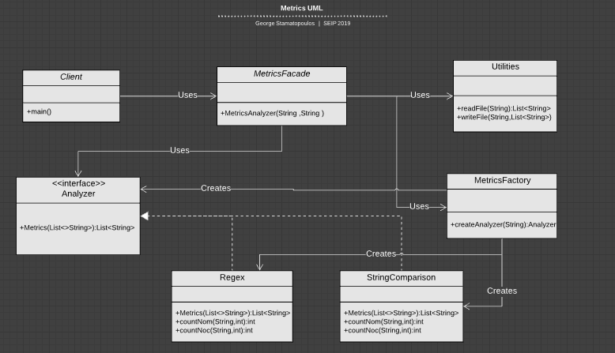

# Metrics

## Description

This is a maven module. The metrics application is about calculating the lines of code, the number of methods and the number of classes for a file that contains code.
The user must give two command line arguments to the application. One of these two arguments must take the path of the file as a string and the other must take the value 'string'(string comparison) or the value 'regex'(regular expressions). This depends on which analysis method the user prefers.
This module uses patterns like facade, factory and strategy.

## UML Class Diagram

